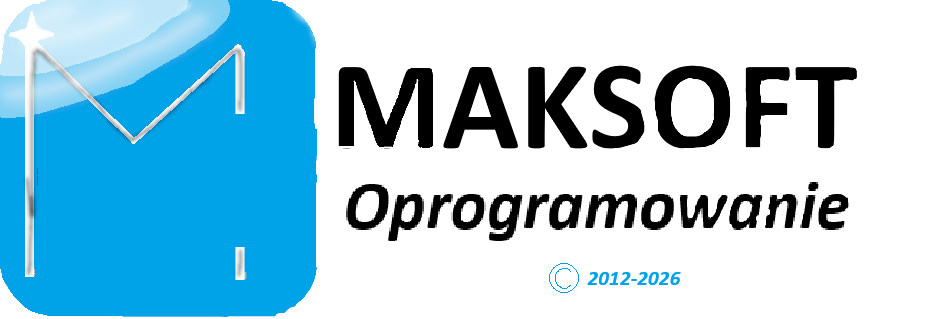

# AlanKingPL #
Lubię język C, nie ciągnie mnie do C++, bo jest zbyt dziwaczny. Szczególnie nie lubię praktyk typu _"C++ z coutem_", czyli piszemy czysty kod w C, ale dajemy mu rozsszerzenie cpp tylko po to, by zamiast printf użyć kurde jakiegoś coat. Kto wymyślił?!!

<!--
# Maksoft Symulator Kuriera Interplanetarnego 2026!!

-->

# Linux! Tylko Linux! #

  

<!--

  

-->

  
  

# Maksoft Symulator Kuriera Interplanetarnego 2026!!

<!--

  

-->
Moje odznaki.

  

  

  

<!---->

<!-- ████████████████████████████████████████████████████ -->
<!--              AlanKingPL — GITHUB README         -->
<!-- ████████████████████████████████████████████████████ -->

## Statystyki

  

<!--

  

&nbsp;&nbsp;

-->

### Nadal nie wierzysz, że używam C i NASM? ##
<!--
https://github-stats-extended.vercel.app/api/top-langs?username=alankingpl0-oss&layout=pie&langs_count=10&theme=shadow_blue
-->

<!--  -->

<!-- -->

<!--  -->
<!--

-->

<!--
](https://wakatime.com/@alankingpl0-oss)
-->
<!--

<!-- 
 -->
-->

<!---->

## Flagowe projekty ##
[RolAsyst](https://github.com/alankingpl0-oss/rolasyst) — Program ułatwiający życie rolnikom. 

[Pinics](https://github.com/alankingpl0-oss/pinics) — nadchodzący system operacyjny. 

[PNC-5](https://github.com/alankingpl0-oss/PNC-5) — autorskie kodowanie znaków 5-bitowe. 

[PowerSzaro](https://github.com/alankingpl0-oss/PowerSzaro) — korekcja RBG do skali szarości SSE. 

[PingSzyfr](https://github.com/alankingpl0-oss/PingSzyfr) — program szyfrujący przy uyciu XOR. 

[PowerKilo](https://github.com/alankingpl0-oss/PowerKilo) — wygodny edytor tekstu z obsługą wtyczek. 

[Zobacz więcej](https://github.com/alankingpl0-oss?tab=repositories)

---

<!--

  

-->

## Kontakt ##

Skontaktuj się ze mną przez e-mail: maksoft@kolejopedia.pl.

---

## 🌟 O mnie ##

 

 * Programy Open Source wydaję tylko na licencji GPL, zazwyczaj 2.0.
 * Lubię język C.
 * Nie specjalnie C++.
 * Często piszę programy w asemblerze **NASM**.
 * Nie lubię praktyk _C++ z coutem_.
 * Pracuję nad nadchodzącym system operacyjnym Pinics (Pingwin Information & Computing Service) opartym na xv6.
 * Eksperymentuję z Fortranem, znadzie się też Pascal (głównie Free Pascal, a nawet Turbo Pascal).

## 📈 Moja aktywność

  

Robi wrażenie? Niski poziom nie daje anic chwili przerwy!

<!--

-->

Nie wiem czemu jest po angielsku. Pewnie coś jest zwalone koncertowo, ale wiadomo o co chodzi.

<!--  -->

 

 

---

*Copyleft 2026 AlanKingPL. All rights reversed.*

<!-- ## Hi there 👋

**alankingpl0-oss/alankingpl0-oss** is a ✨ _special_ ✨ repository because its `README.md` (this file) appears on your GitHub profile.

Here are some ideas to get you started:

- 🔭 I’m currently working on ...
- 🌱 I’m currently learning ...
- 👯 I’m looking to collaborate on ...
- 🤔 I’m looking for help with ...
- 💬 Ask me about ...
- 📫 How to reach me: ...
- 😄 Pronouns: ...
- ⚡ Fun fact: ...
-->
